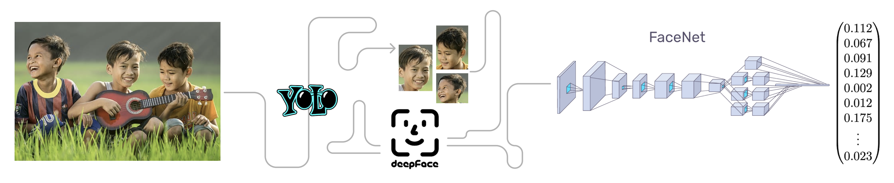

# Face-Recognition
This repository contains a comprehensive face recognition system that combines YOLOv8 for face detection and FaceNet for face recognition. Face recognition is a critical technology with applications in security, surveillance, and user authentication. This project leverages state-of-the-art deep learning models to achieve accurate and reliable face recognition.

</img>

- Detect faces in images using YOLO.
- Crop and save the detected faces.
- Recognize faces using DeepFace and categorize them based on a pre-trained model.
- Do whatever you feel like from the features extracted.

## Demo
Experience the functionality of our face recognition model, which has been trained on a dataset featuring faces of few politicians, by visiting [Live Demo](https://face-recognition-ml.streamlit.app/). Please keep in mind that this deployment is specifically designed for demonstration purposes and may not be fine-tuned for optimal performance in real-world scenarios. The best place to start and learn about the project's evolution is the ["o-testing"](https://github.com/sOR-o/Face-Recognition/tree/main/o-testing) folder. Here, you'll find different levels of understanding, providing comprehensive insights into the project's development.

[</img>](https://github.com/sOR-o/Face-Recognition/assets/69918938/dd4034c0-2828-4bde-92e4-294854c9e477)

###### Acknowledgement : For details on the deployment of the model using Streamlit, refer to this [repository](https://github.com/NikhilKalloli/Face-Recognition).

  ## Installation
1. Clone the Repository : `https://github.com/sOR-o/Face-Recognition.git`
2. Install Dependencies : `pip install -r requirements.txt`
3. play with code.

-Can be improved by transfer learning (obviously 😉)

## Contributing
Contributions to this project are welcome! If you'd like to contribute, feel free to submit issues, feature requests, or pull requests.
  
